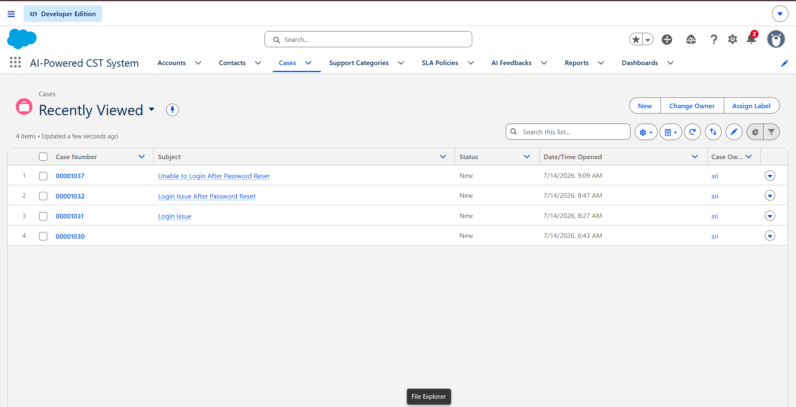
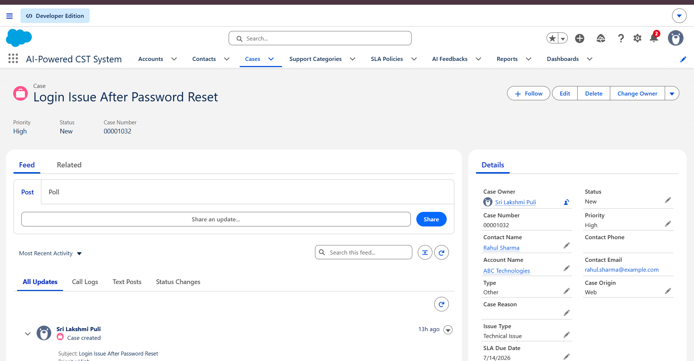
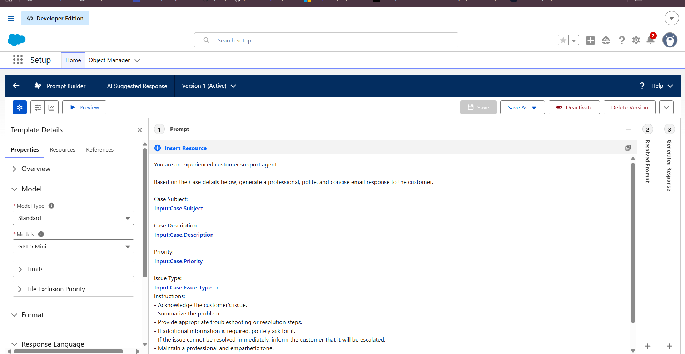
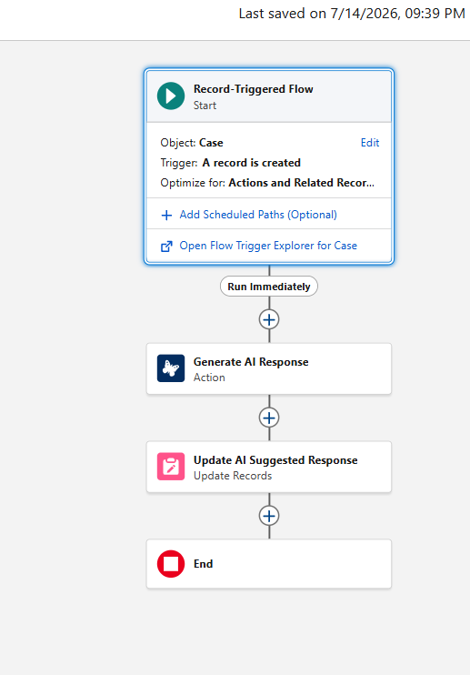
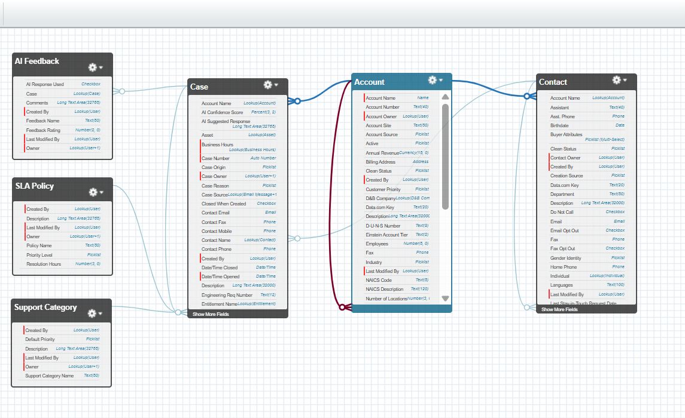

# 🤖 AI-Powered Customer Support Ticketing System

An AI-powered customer support application built on **Salesforce Developer Org** that automates case management using **Flow Builder**, **Prompt Builder**, and **Agentforce**. The system improves support efficiency through automated case classification, SLA tracking, and AI-generated response suggestions.

---

## 🚀 Features

- 🎫 Customer Support Case Management
- 🤖 AI Suggested Responses using Prompt Builder
- ⚡ Automated Case Classification & Priority Assignment
- ⏰ SLA Tracking with Record-Triggered Flows
- 📊 Reports & Dashboards
- 🔐 Role-Based Security (Profiles & Permission Sets)
- 💬 AI Feedback Collection

---

## 🛠️ Tech Stack

- Salesforce Developer Org
- Flow Builder
- Prompt Builder
- Agentforce
- Lightning App Builder
- Reports & Dashboards

---

## 📂 Salesforce Objects

### Standard Objects
- Account
- Contact
- Case

### Custom Objects
- Support Category
- SLA Policy
- AI Feedback

---

## 📸 Screenshots

### Lightning App

### Case Management

### Prompt Builder

### AI Suggested Response

### Record Triggered Flow

### Objects & Fields Relation

---

---

## 📖 Documentation

Detailed project documentation is available in the **Documentation** folder.

---

## 👥 Team Members

- Guttula Swathi
- Nikitha Jinugu
- Sri Lakshmi Puli
- Amara Shiva Shankar Javisetty
- Mounisha Rathnavalli Savaram

---

## 🏫 Institution

**Vishnu Institute of Technology**

Academic Year: **2025–2026**

---

⭐ If you found this project useful, consider giving it a star.
